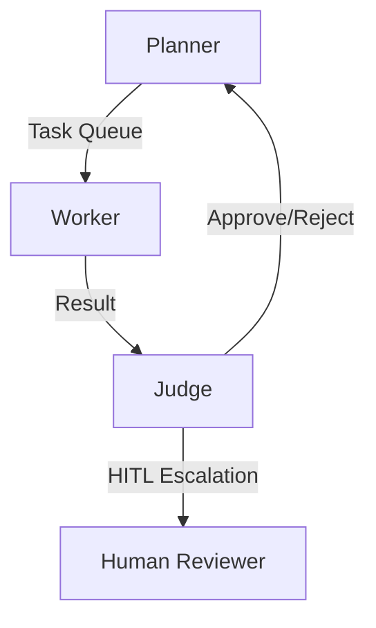
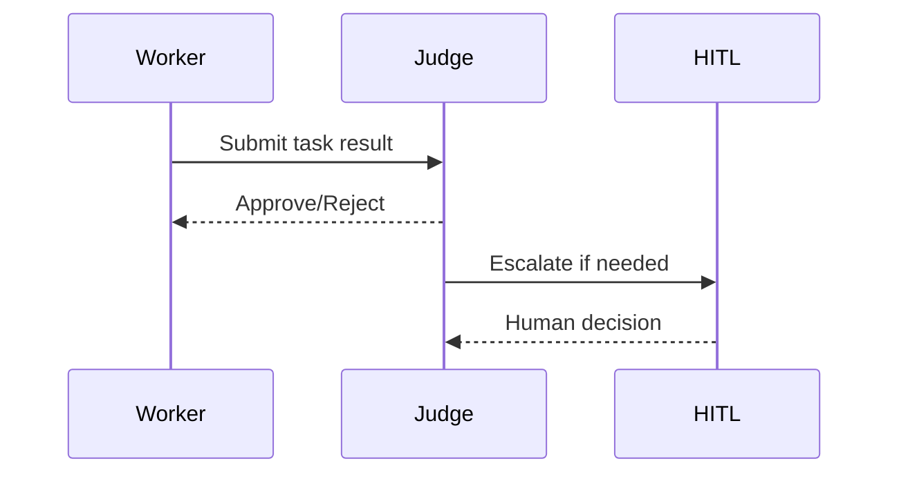
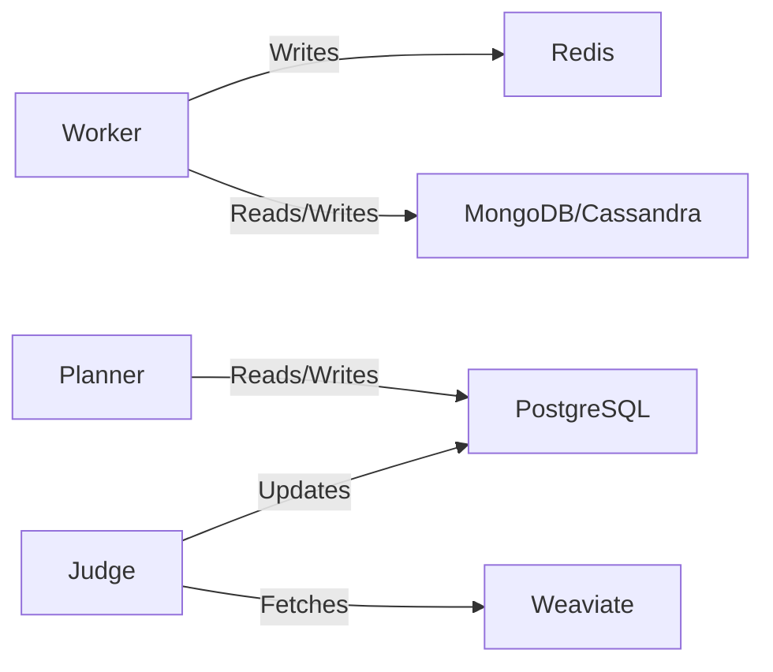
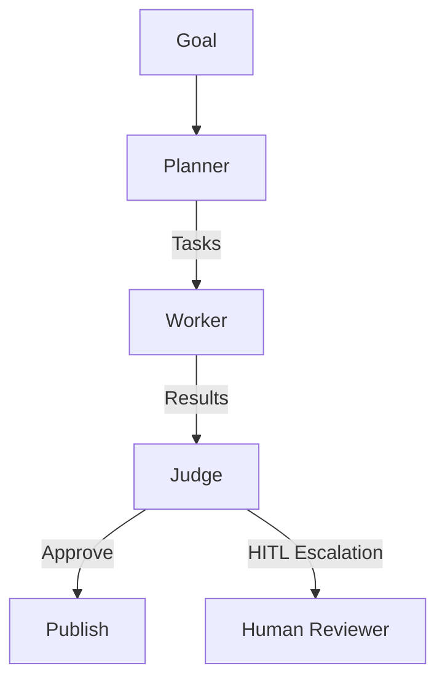
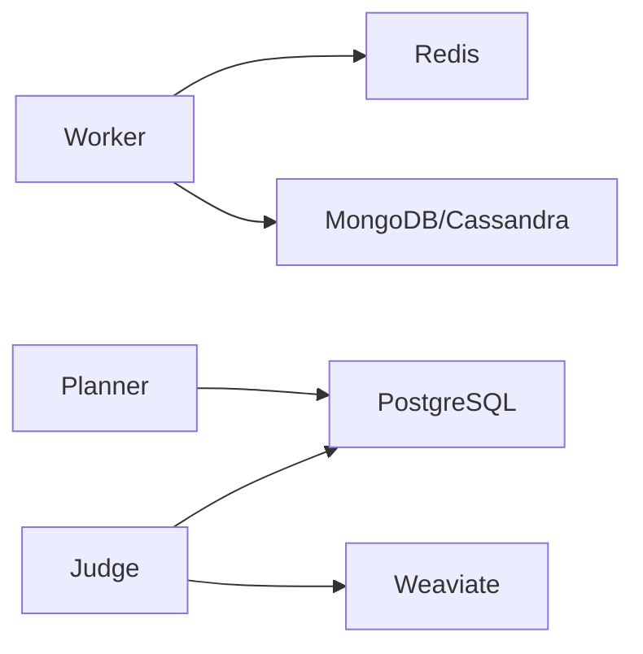

# Project Chimera: System Architecture Document

## 1. Introduction

This document provides a comprehensive architecture strategy for Project Chimera, covering agent patterns, HITL integration, data storage, system components, workflow orchestration, and security considerations.

## 2. Agent Pattern

**Hierarchical Swarm** is adopted as the core agent pattern:

* **Planner**: Decomposes goals into tasks, monitors global state, dynamically re-plans.
* **Worker**: Executes atomic tasks, consumes MCP Tools, stateless.
* **Judge**: Validates Worker outputs, enforces persona consistency, triggers HITL if required.

### 2.1 Sub-Planners and Swarm Roles

* **Sub-Planners**: Handle specialized domains (e.g., Social Media Engagement, Trend Analysis).
* **Worker Types**: Text generation, image/video generation, on-chain transactions.
* **Judge Specializations**: Ethical review, financial oversight, media validation.

## 3. Human-in-the-Loop (HITL)

HITL ensures safety and brand compliance:

* **High Confidence (>0.90)**: Auto-approve.
* **Medium Confidence (0.70-0.90)**: Pause, HITL review optional.
* **Low Confidence (<0.70) / Sensitive Content**: Mandatory HITL review.

## 4. System Components

### 4.1 Central Orchestrator

* Manages global state, task allocation, and multi-tenant control.
* Provides the Operator Dashboard for fleet monitoring and campaign management.

### 4.2 Agent Swarms

* Ephemeral, stateless containers running Worker and Judge nodes.
* Each swarm operates under FastRender hierarchy.

### 4.3 Perception Layer

* Ingests external resources exclusively through MCP Resources.
* Semantic filtering and trend detection triggers task creation.

### 4.4 Creative Engine

* Uses MCP Tools for multimodal content generation (Text, Images, Video).
* Character consistency enforced via reference IDs and style LoRA embeddings.

### 4.5 Action System

* Platform-agnostic publishing using MCP Tools.
* All interactions logged and rate-limited at MCP layer.

### 4.6 Agentic Commerce

* Each agent has a non-custodial wallet managed via Coinbase AgentKit.
* CFO Judge sub-agent enforces budget limits and detects anomalies.

## 5. Data Management Architecture

| Data Type                  | Storage             | Notes                                          |
| -------------------------- | ------------------- | ---------------------------------------------- |
| Long-term memory & persona | Weaviate / MongoDB  | For RAG pipelines and semantic retrieval       |
| Transactional data         | PostgreSQL          | ACID compliance for tasks, wallets, audit logs |
| Ephemeral task queues      | Redis               | High-speed Worker communication                |
| Video & media metadata     | Cassandra / MongoDB | Handles high-volume ingestion                  |

## 6. Communication & Integration

* **Model Context Protocol (MCP)**: Standardized interface for all external APIs and tools.
* **Transport**: Local (Stdio), Remote (SSE/WebSocket).
* **Primitives**:

  * Resources: Passive data ingestion.
  * Tools: Executable actions.
  * Prompts: Templates for reasoning and persona context.

## 7. Security & Compliance

* Wallet private keys stored in enterprise-grade secret managers (AWS Secrets Manager / HashiCorp Vault).
* AI-generated content labeled with platform-native AI disclosure flags.
* Sensitive content filtered and routed to HITL.
* Compliance with emerging AI transparency laws (e.g., EU AI Act).

## 8. Performance & Scalability

* Auto-scaling Worker pool to support ≥1,000 concurrent agents.
* Latency for high-priority interactions ≤10 seconds (excluding HITL review).
* Optimistic Concurrency Control (OCC) prevents state conflicts.

## 9. Diagrams

### 9.1 Agent Workflow

### 9.2 Data Flow

### 9.3 HITL Integration

## 10. Conclusion

The architecture of Project Chimera enables scalable, autonomous influencer operations with strong safety, ethical governance, and economic autonomy. Hierarchical Swarm ensures parallelism and robustness; HITL safeguards content quality; hybrid data storage meets high-volume, high-velocity requirements; MCP ensures modular, standardized connectivity.
