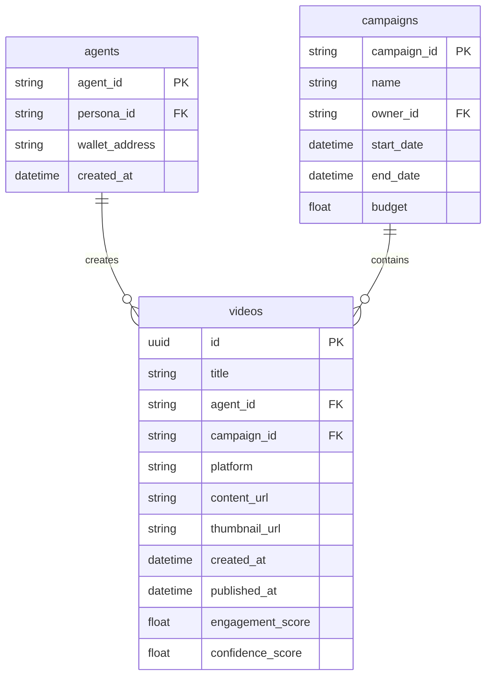

# Technical Specification

## API Contracts

### Agent Task Endpoint (Planner -> Worker)

```json
POST /api/tasks
{
  "task_id": "uuid-v4-string",
  "task_type": "generate_content | reply_comment | execute_transaction",
  "priority": "high | medium | low",
  "context": {
    "goal_description": "string",
    "persona_constraints": ["string"],
    "required_resources": ["mcp://twitter/mentions/123", "mcp://memory/recent"]
  },
  "assigned_worker_id": "string",
  "created_at": "timestamp",
  "status": "pending | in_progress | review | complete"
}
```

### MCP Tool Execution (Worker -> MCP Server)

```json
POST /api/mcp/call_tool
{
  "server_name": "string",
  "tool_name": "string",
  "arguments": { "key": "value" }
}
```

Response:

```json
{
  "success": true,
  "result": {"key": "value"},
  "error": null
}
```

## Database Schema

### Video Metadata ERD



## Infrastructure Notes

* **Queue Layer**: Redis for task and review queues.
* **Semantic Memory**: Weaviate for long-term agent memory.
* **Transactional Ledger**: On-chain storage for agent transactions (Base/Ethereum/Solana).
* **HITL Queue**: React + Tailwind interface consuming review_queue for moderation.
